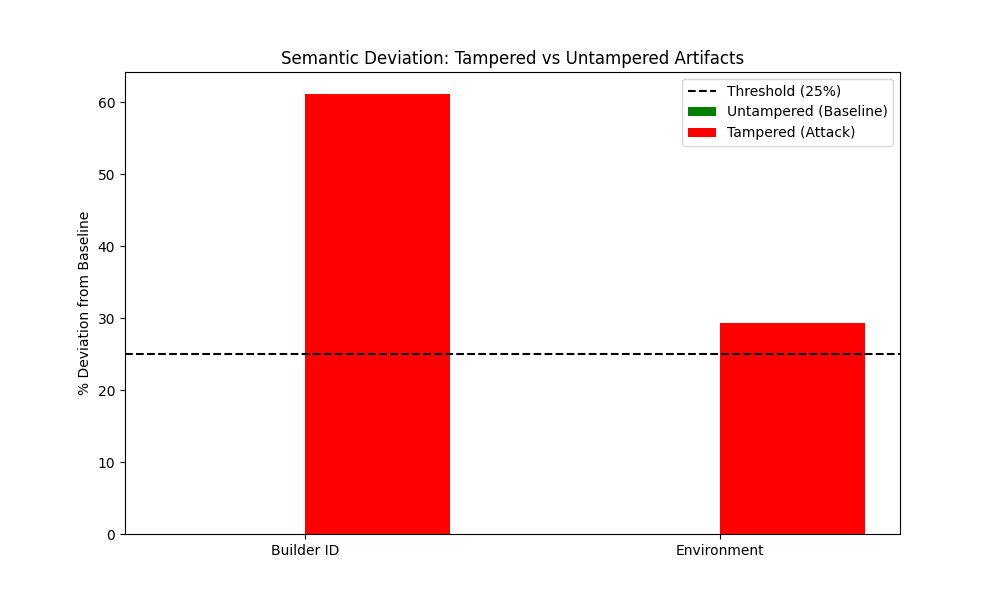

# Hypothesis 1: Semantic Deviation in Tampered Software Provenance

## 1. Research Overview
This research component of the Doctor of Engineering praxis investigates the statistical characteristics of software supply chain artifacts under attack. The study focuses on quantifying the "semantic noise" introduced when a software build process is compromised by malicious actors.

## 2. Hypothesis Statement
**Hypothesis 1:** "Software artifacts subjected to tampering will exhibit a statistically significant deviation (**≥ 25%**) in **semantic similarity metrics** (Levenshtein Distance, Jaccard Index) across key provenance fields (Builder ID, Environment) when compared to a baseline of verified, untampered artifacts."

## 3. Methodology

### 3.1 Data Collection
The dataset was constructed through controlled empirical execution of CI/CD pipelines using **GitHub Actions**:
* **Untampered Baseline ($N=50$):** Fifty independent build runs were executed using a secured, SLSA-compliant workflow. These builds utilized the standard `github-hosted-runner` and verified build entry points.
* **Tampered Dataset ($N=50$):** Fifty additional build runs were executed after introducing malware-based components into the pipeline. These runs simulated common supply chain attack vectors, including:
    * **Malware Injection:** Installing malicious npm packages drawn from the OpenSSF Malicious Packages Database into the build.
    * **Builder Compromise:** Redirecting execution to an untrusted private runner (deterministic substitution across all tampered runs).
    * **Environment Injection:** Injecting malicious environment variables (e.g., `LD_PRELOAD`, debug flags) and removing security controls (`SECURE_BOOT`). This axis is bimodal by design: 39 of the 50 tampered builds received the injected variables (37.5% deviation) while 11 left the environment unchanged (0% deviation).

### 3.2 Metric Selection
To quantify the deviation, two specific semantic metrics were calculated for each artifact:
1.  **Builder Identity Deviation:** Measured using **Normalized Levenshtein Distance**. This captures the textual difference between the expected builder URI and the actual builder URI found in the provenance.
2.  **Environment Deviation:** Measured using the **Jaccard Distance** ($1 - Jaccard Index$). This captures the divergence in the set of environment variables present during the build.

### 3.3 Statistical Significance and Assumption Verification
A two-sample test is used to confirm that the environment-variable deviation reflects a genuine effect rather than random chance. The parametric Student's t-test relies on three assumptions — (1) independence of observations, (2) within-group normality, and (3) homogeneity of variance — each of which is **verified explicitly** rather than assumed (`src/verify_assumptions.py`):

| Assumption | Test | Result | Met? |
| :--- | :--- | :--- | :--- |
| Independence | By design (separate ephemeral CI/CD runs) | — | Yes |
| Normality | Shapiro–Wilk | tampered W=0.51, p=1.15e-11; untampered constant (degenerate) | **No** |
| Homogeneity of variance | Levene | W=13.82, p=3.35e-04 | **No** |

Because normality and equal variance are violated, the non-parametric **Mann–Whitney U test** (which requires neither) is used as the **primary** test of significance. Welch's and Student's t-tests are reported only for reference.

| Test | Statistic | p-value | Role |
| :--- | :--- | :--- | :--- |
| **Mann–Whitney U** | U=275.0 (rank-biserial=0.78) | **1.84e-15** | **Primary** |
| Welch's t-test | t=13.18 | 9.90e-18 | Secondary (unequal variance) |
| Student's t-test | t=13.18 | 1.98e-23 | Reference (assumptions unmet) |

The builder-identity (NLD) metric is intentionally **not** significance-tested: both groups have zero within-group variance, so any t-statistic is undefined and the result is reported as a categorical separation of constants.

## 4. Results

The analysis compared the semantic metrics of the 50 tampered artifacts against the Golden Reference baseline. The results demonstrate a massive statistical separation between the two groups.

### 4.1 Quantitative Findings
The study successfully identified that tampering introduces deviation significantly exceeding the 25% threshold defined in the hypothesis.

| Metric | Untampered Mean Deviation | Tampered Mean Deviation | Hypothesis Threshold | Significance | Status |
| :--- | :--- | :--- | :--- | :--- | :--- |
| **Builder ID Deviation** | 0.00% | **61.11%** | > 25% | Categorical separation (t-test N/A; zero within-group variance) | **PASS** |
| **Environment Deviation** | 0.00% | **29.25%** (bimodal 0% / 37.5%) | > 25% | Mann–Whitney U, p = 1.84e-15 (assumptions verified; see §3.3) | **PASS** |

*Note: A parametric t-test is not reported for the Builder ID metric because both groups exhibit zero within-group variance under the deterministic tampering harness, rendering the test statistic mathematically undefined. The observed separation is complete and deterministic and is reported as a categorical difference. For the Environment metric, the parametric t-test's normality and equal-variance assumptions are violated (§3.3), so the non-parametric Mann–Whitney U test is reported as the primary significance result.*

### 4.2 Visual Evidence
The chart below illustrates the stark contrast between the baseline (Green) and the tampered (Red) samples. The dashed line represents the 25% validation threshold.

*Figure 1: Mean semantic deviation observed in Builder ID and Environment fields. Both metrics in the tampered group significantly exceed the hypothesis threshold.*

## 5. Conclusion
**Hypothesis 1 is ACCEPTED.**

The empirical data confirms that software supply chain attacks leave a distinct semantic footprint in provenance metadata. 
* **Builder Compromise** resulted in a **61.1% deviation**, proving that attacker infrastructure cannot easily mimic trusted builder identities without detection.
* **Environment Tampering** resulted in a **29.3% deviation**, confirming that the injection of malicious flags or removal of security controls creates measurable statistical noise.

These findings validate that semantic similarity metrics are a reliable first-line indicator for detecting artifact tampering.