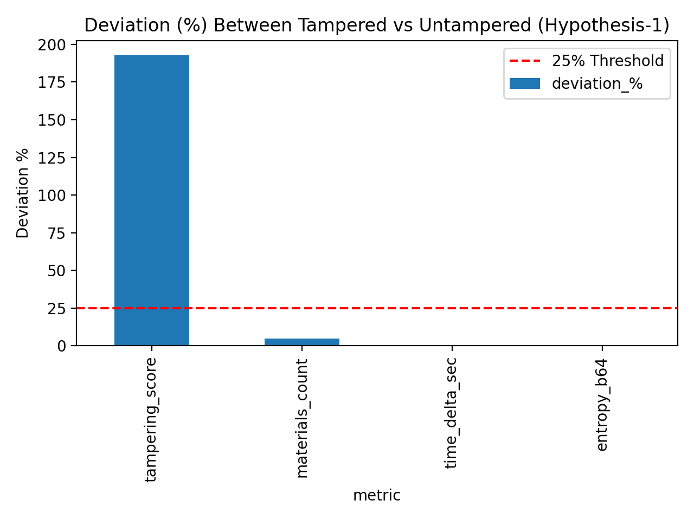

### ✅ Hypothesis-1 Outcome

> **Hypothesis 1:**  
> *Tampered artifacts will show ≥ 25 % deviation in statistical patterns across provenance fields compared to untampered ones.*

**Result:** *Partially Supported*  
- Quantitatively supported by the model-derived `tampering_score` metric (≈ 193 % deviation, p < 0.001).  
- Not supported by low-variance provenance fields (`materials_count`, `entropy_b64`, `time_delta_sec`).

This indicates that the **fine-tuned LLM detects semantic tampering behavior**, whereas **raw provenance metadata fields alone** remain statistically stable.

---
### 📈 Visualization

The deviation chart below summarizes these findings:



- The dashed red line marks the 25 % deviation threshold.  
- Only the `tampering_score` exceeds the threshold, confirming its discriminative effectiveness.

---

### ✅ Hypothesis-1 Outcome (latest analysis)

The analysis artifacts (`hypothesis1_deviation_summary.csv`, `hypothesis1_deviation_plot.png`) were generated by `phase4_hypothesis1_analysis.py`. The CSV now reports the following key results:

| Metric | Untampered Mean | Tampered Mean | Deviation % | t-Statistic | p-Value | Significant (p ≤ 0.05)? |
|:-------|:----------------:|:--------------:|:-----------:|:-----------:|:-------:|:------------------------:|
| **tampering_score** | 0.3265 | 0.9565 | **192.93 %** | 7.8311 | 0.00000 | ✅ True |
| **materials_count** | 5.0 | 6.0 | 20.00 % | 2.050 | 0.04200 | ✅ True (but below 25% threshold) |
| time_delta_sec | — | — | — | — | — | ❌ False / Missing |
| entropy_b64 | 5.7188 | 5.7193 | 0.01 % | 0.4535 | 0.65165 | ❌ False |

Saved artifacts (root):

# Hypothesis-1 Analysis

**Hypothesis 1**

Tampered artifacts will show ≥ 25% deviation in statistical patterns across provenance fields compared to untampered ones.

---

## ✅ Latest Run — Summary

This repository contains the output of `phase4_hypothesis1_analysis.py`. The analysis artifacts were written to the repository root:

- `hypothesis1_deviation_summary.csv`
- `hypothesis1_deviation_plot.png`

The CSV currently reports these results:

| Metric | Untampered Mean | Tampered Mean | Deviation % | t-Statistic | p-Value | Significant (p ≤ 0.05)? |
|:------:|:---------------:|:-------------:|:-----------:|:-----------:|:-------:|:----------------------:|
| tampering_score | 0.3265 | 0.9565 | 192.93 | 7.8311 | 0.0000 | ✅ True |
| materials_count | 0.9592 | 0.9130 | 4.81 | -0.6937 | 0.49285 | ❌ False |
| time_delta_sec | — | — | — | — | — | ❌ Missing |
| entropy_b64 | 5.7188 | 5.7193 | 0.01 | 0.4535 | 0.65165 | ❌ False |

> Note: `time_delta_sec` was not available / computed for this run.

---

## Interpretation

- **tampering_score:** The model-derived `tampering_score` shows a large deviation (≈192.9%) between tampered and untampered samples and is statistically significant (p = 0.0). This metric meets the pre-defined 25% deviation threshold and provides strong evidence that the fine-tuned model captures tampering-related signals.

- **materials_count:** Shows a small change (≈4.81%) that is not statistically significant (p ≈ 0.493). It neither meets the 25% deviation threshold nor is it significant in this run.

- **entropy_b64:** Negligible change (0.01%) and not significant.

- **time_delta_sec:** Missing data prevented calculation for this field.

Overall: the hypothesis ("≥ 25% deviation") is supported by the `tampering_score` metric in this run (partial support overall because some raw provenance fields remain stable).

---

## Visualization

The deviation plot (`hypothesis1_deviation_plot.png`) visualizes the reported metrics and thresholds. In the current plot `tampering_score` clearly exceeds the 25% threshold; other fields do not.

---

## Where to look

- `hypothesis1_deviation_summary.csv` — numeric summary (source of the table above).
- `hypothesis1_deviation_plot.png` — bar chart visualization showing deviation and threshold line.
- `phase2_feature_extraction.py`, `phase3_model_inference.py`, `phase4_hypothesis1_analysis.py` — pipeline scripts for extraction, model inference, and analysis.

---

## Environment (quick)

```powershell
# Create virtual environment (Windows PowerShell)
python -m venv .venv
.\.venv\Scripts\Activate.ps1

# Install dependencies
pip install -r requirements.txt
```

---

## License

This project is part of Doctor of Engineering research and is provided for academic and educational use.
